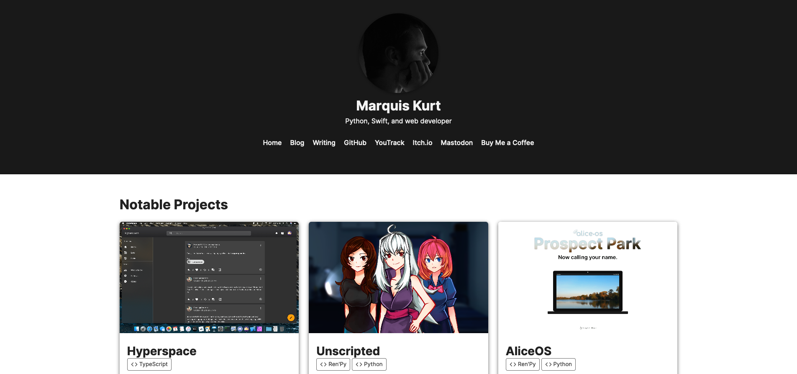

# Camino <small>Beta</small>

A simple, Apple-inspired KISS theme for Jekyll.



Camino is a Jekyll theme I have created for my own personal website. Camino is a simple, KISS theme for Jekyll that mostly takes inspiration from Apple's interface designs and supports dark mode, as well as the `dark-mode-toggle` utility provided by the Chrome developers.

Camino includes, but is not limited to, the following features:

- Custom accent colors
- Dark mode functionality (and toggle)
- Special `document` and `post` layouts for blogs and articles
- Responsive behavior

## Usage

In your `_config.yml`, add the following line:

```yml
remote_theme: alicerunsonfedora/camino
```

## Example Configuration

```yaml
title: Camino
author: Marquis Kurt
description: A KISS theme for Jekyll

webmaster_email: contact@example.com

doc_img_url: "/images/cwp/"
cover_img_url: "/images/covers/"
profile_img_url: "logo.svg"

accent:
  light:
    standard: "rgb(255, 149, 0)"
    highlight: "#ffaa33"
  dark:
    standard: "rgb(255, 159, 10)"
    highlight: "#ffb23b"

navigation:
  - name: "Home"
    link: "/index.html"
  - name: "GitHub"
    link: "https://github.com/alicerunsonfedora/camino"

markdown: kramdown
kramdown:
  input: GFM
  syntax_highlighter: rouge
  syntax_highlighter_opts:
    css_class: 'highlight'

plugins:
  - jekyll-octicons
  - jekyll-sitemap
  - jekyll-feed
  - kramdown
```

## License

Camino is open-source software licensed under the Mozilla Public License v2.